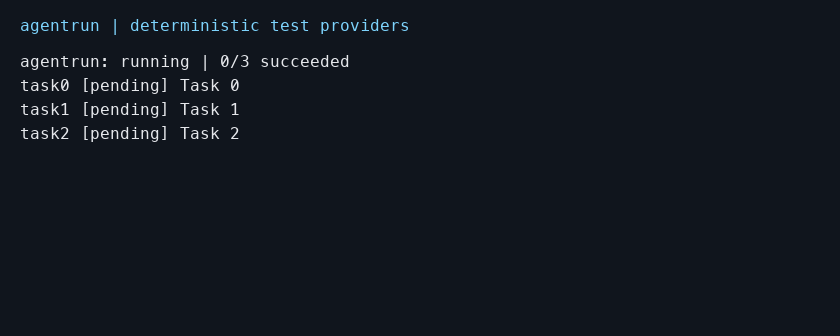

# agentrun

Run Claude Code and Pi tasks in separate Git worktrees. Each successful task keeps a branch, a binary patch, and a report. The CLI runs each provider in its own worker process.



The demo uses explicit test adapters. It does not call a paid provider.

## Requirements and installation

Use Node.js 24 and Git on macOS or Linux. Repository locks require `/usr/bin/lockf` on macOS or `flock` on Linux. Configure provider authentication with the provider's own tools before running tasks. `agentrun doctor` checks the runtime, lock utility, and both provider accounts.

Version 0.1.0 is intentionally unpublished on npm. npm publication is outside the current plan. The package names are `agentrun` and `@agentrun/core`. Install both reviewed local tarballs together:

```sh
npm install ./agentrun-core-0.1.0.tgz ./agentrun-0.1.0.tgz
npx --no-install agentrun doctor
```

These commands assume that both reviewed tarballs are in the current directory. Keep the installation directory to reuse its `node_modules/.bin/agentrun` executable. Registry installation is not available for this version.

To run from a reviewed source checkout, use Node.js 24 and pnpm 10.29.3. Run these commands from the repository root:

```sh
pnpm install --frozen-lockfile
pnpm build
node packages/cli/dist/bin.mjs doctor
```

Use `node packages/cli/dist/bin.mjs` instead of `agentrun` for the commands below. From another repository, use the absolute path to that built file.

## Run a task

Use a disposable Git repository first. Commit the base files. Add `.agentrun/` to `.gitignore` to keep private run data out of commits. Create `TASKS.md`:

```markdown
---
base: HEAD
concurrency: 1
stallTimeout: 1 minute
maxDuration: 2 minutes
---
## example: Write a small example
agent: claude-code
maxTurns: 3
maxBudgetUsd: 0.25

Write example.txt with the text "example". Do not run shell commands.
```

```sh
agentrun run TASKS.md --dry-run --json
agentrun run TASKS.md
agentrun report
agentrun report --json
agentrun resume
agentrun resume --retry-failed
```

A dry run validates tasks and resolves the Git base without invoking providers. For Pi, set `agent: pi` and `model: provider/modelId`. Pi rejects `maxTurns` and `maxBudgetUsd`. Choose a model available in your own Pi account.

`run --json` emits one JSON event per line. `report --json` emits one JSON report. Reports contain task prompts, result text, repository paths, and diffs. Keep them private unless you review and sanitize them. Worker ownership tokens and Git process journals are excluded from report JSON.

## Choose an execution ID

Automation can save an ID before starting work:

```sh
agentrun run TASKS.md --run-id attempt-001-abcd --json
agentrun report attempt-001-abcd --json
agentrun resume attempt-001-abcd --json
```

An ID starts with a letter or digit and contains at most 128 letters, digits, underscores, or hyphens.
Starting an existing ID fails without overwriting its state. Use its exact ID to resume.
Existing branch or worktree collisions also fail. Different IDs can share the same four-character branch suffix.
Collision checks ignore letter case on macOS and Linux. Linked checkouts share run reservations and branch ownership records in Git's common directory.
Resume requires a matching reservation and proof that the run created its resources. A saved branch name is only a plan.

An empty reservation, missing creation proof, or legacy run without ownership records requires inspection. Automatic resume refuses these cases and preserves the files.
This includes Git failures after resource creation, before the CLI saves its creation receipt. Existing reports remain readable.
Use a different run ID for new work. Keep the reservation and state while you inspect the original run.
A directory with missing or corrupt state requires inspection; the CLI does not replace it.
The commands without an ID retain their current defaults. Automation must not guess its attempt from the latest run.

## Upgrade with in-flight runs

Finish in-flight runs with the old build before upgrading. Keep that build and backups of run data, Git data, and workspaces.
Old runs without ownership records cannot safely migrate from saved names. Both explicit `resume <id>` and latest-run `resume` refuse them.
Their reports remain readable. This change does not preserve automatic resume for old in-flight runs.

Do not mix old and new builds on the same repository, including linked checkouts.
Older builds ignore the new ownership records. The state schema remains version 1, which does not establish runtime compatibility.
If you already upgraded, preserve the work and backups before using the retained old build to finish an old run.
Use the old build only when the repository has not acquired new-build runs or ownership records.
If both versions have touched the repository, inspect the histories before further execution. There is no automatic migration or downgrade procedure.

## Inspect incomplete creation

A creation receipt is the record that binds a run to its workspace and branch name.
`git worktree add -b` can create a branch or workspace and then fail.
Triggers include a failed `post-checkout` hook, checkout or Git LFS errors, the sixty-second Git limit, and the task deadline.
A crash, interruption, or failed receipt write can also leave resources without valid proof.
The CLI preserves those resources. `resume --retry-failed` refuses reuse or cleanup while ownership is unproved, even after the original error is fixed.
A Git failure after resource creation can block automatic retry.

Inspect the saved run and Git state before recovery:

1. Stop execution against this repository and its linked checkouts.
2. Back up the run data, Git data, and workspace, including untracked files.
3. Identify the exact run ID, originating checkout, task, workspace path, and full branch ref from the saved state.
4. Resolve the originating checkout's exact Git common directory with `git rev-parse --path-format=absolute --git-common-dir`.
5. Inspect `git worktree list --porcelain` and the exact ref with `git show-ref --verify refs/heads/<branch>`.
6. Inspect the workspace's Git common directory, branch, and `git status --porcelain=v1 --untracked-files=all --ignored`.
7. Compare the saved identities with the reservation and receipt in the resolved common directory.

Reservations are at `agentrun/ownership/runs/<lowercase-run-id>/owner.json` under that common directory.
Receipts are at `agentrun/ownership/branches/<sha256-of-lowercase-branch>.json`. The hash uses the branch name without `refs/heads/`.
On macOS, calculate the hash with the exact branch name:

```sh
printf '%s' 'agentrun/<task-id>-<suffix>' | tr '[:upper:]' '[:lower:]' | shasum -a 256
```

On Linux, replace `shasum -a 256` with `sha256sum`. Do not use `echo`; its newline changes the hash.
A branch or workspace without its receipt has incomplete ownership. Missing, unreadable, mismatched, or partial records also require inspection.
Check file type and size before reading a record. Do not read a pipe or device as JSON.
A matching name alone does not prove creation. Do not create, rewrite, or copy receipts to bypass refusal. Do not delete an invalid receipt to make a retry pass.

If any identity or dirtiness check is uncertain, retain the resources.
For new work, use a different run ID and unused branch suffix.
Manual cleanup requires verified common directory, run, workspace, ref, and dirtiness, plus preserved backups and evidence of creation.
Compare the saved acquisition output with the branch history and registered workspace. These records help inspection but do not replace a creation receipt.
If the records do not establish who created each resource, preserve it.
Remove only confirmed disposable partial resources through ordinary Git operations. Do not use force removal, reset, or forced branch deletion.
If normal Git refuses cleanup, stop and preserve the resources.
Manual cleanup does not guarantee that resume will work. Keep the run reservation and state.
Remaining invalid records still block resume. Cleanup does not make a legacy run compatible.

## Restrict review tools

Add `tools: read-only` in frontmatter or under a task heading:

```markdown
## review: Review the candidate
agent: pi
tools: read-only

Inspect the supplied diff and report your findings.
```

Claude receives only Read, Glob, and Grep. Pi receives only read, grep, find, and ls.
Unknown or unsupported profiles fail before provider work. Read-only tasks cannot use setup or load project settings.
This limits model tools, not OS permissions. SDK internal writes are outside this restriction.
A successful task can produce no changes. Its result text and immutable delivery commit remain in the report.
An unchanged commit does not prove that no write occurred.

## Setup, cancellation, and recovery

Optional frontmatter `setup` runs a shell command in each worktree before provider work. Automatic provider retries reuse the owned worktree and completed setup. Recreating a worktree clears setup completion. Treat setup commands and task files as trusted input.

Provider project settings are disabled by default. `--load-project-settings` enables Claude project/local settings and Pi `.pi/settings.json`. Pi extensions, skills, templates, and context files remain disabled. This flag can enable hooks and shell configuration.

Press Ctrl-C once to save interruption and clean up owned processes. The interrupted worktree remains for `resume`. Pressing Ctrl-C again within three seconds forces exit; resume must finish recovery. Resume starts a new provider conversation, rather than continuing a saved provider session.

Transient spawn errors and crashes before the first tool call get at most three attempts, with jitter around one-second and two-second delays. Storage failures, provider task failures, protocol errors, setup errors, stall timeouts, and task deadlines do not automatically retry. Use `resume --retry-failed` only after inspecting the failure.

Defaults are two concurrent tasks, five minutes without events, and sixty minutes per task. `maxDuration` covers acquisition, setup, provider attempts, backoff, and delivery. It starts cancellation; it does not bound total exit time. Cleanup retains the task permit and can take longer. Each Git command has a separate sixty-second limit.

## Deliverables and limits

Inspect `.agentrun/runs/<run-id>/report.md`, `report.json`, and `tasks/<task-id>/diff.patch`. Successful delivery commits tracked and new files, saves exact patch bytes, and then marks success. Branches use `agentrun/<task-id>-<last-four-run-id-characters>`.

Worktrees are removed without force on ordinary completion. Dirty or interrupted worktrees remain. `--keep-worktrees` retains worktrees. Costs are provider reports, not invoice checks. Successful duration ends at provider completion; failure duration ends at the saved failure transition.

Ownership records bind names and workspace identity, not branch commits.
External deletion, recreation, or rewriting of a branch, Git data, or a receipt invalidates the provenance assumptions.
A branch recreated outside agentrun under an owned name can be reused and include unrelated commits in delivery.
The records prevent accidental reuse between cooperating runs, not external replacement.
Worktrees and tool restrictions are not a security sandbox. Do not run untrusted prompts. Windows and deliberately escaped daemons are unsupported. State uses atomic replacement without an fsync guarantee for power loss. Run data includes private events and prompts. Do not commit raw captures.

Exit codes: 0 for success, 1 for failed or unfinished tasks, 2 for configuration errors, and 130 for interruption.

See the [core API](packages/core/README.md), [SPEC](SPEC.md), and [release evidence](docs/evidence/release-v1/README.md). MIT license.

## Future proposal

[Factory and node view](docs/specs/future-factory.md) is a Portuguese draft outside v1. Its features are not implemented.
