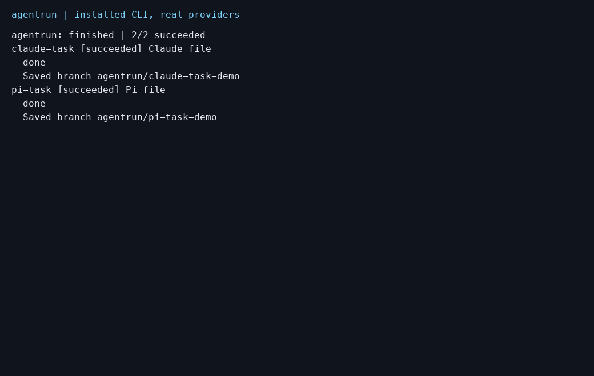

# Release 0.1.0 preparation

Candidate packages: `@agentrun/core` and `agentrun`, both version 0.1.0. They are not published. npm authentication and ownership of the names remain unverified. Registry queries returned 404 for both names; this does not prove ownership.

Verified implementation commit: `06ebdf9b9bea8f48f2da53226fce4c42dfaf00d7`, on branch `chore/release-preparation`. [candidate.json](candidate.json) records the source hashes before that commit. It separates the checked source, the paid-run source, and later documentation changes. Linux CI must verify the committed candidate.

## Scope after the rebase

On 2026-10-05 this branch was rebased onto `main` at `4fb5665`, the squash merge of PR #11. Thirteen package source files changed between the verified candidate and that merge, in process ownership and cleanup. The checks, tarball hashes and real provider run below describe the earlier candidate, not the rebased commit. Before `npm publish`, pack both packages again on the exact publish commit and rerun the installed consumer check.

## Checks and installed packages

Lint, typecheck, 234 tests in 11 files, both builds, and three driver safety checks passed. Tests used one worker and took 467.12 seconds. The prior exact starting HEAD also passed Linux CI. This candidate has local macOS verification; it does not yet have its own Linux CI result.

[tarballs.json](tarballs.json) records SHA-256 hashes and each packed file. Both tarballs contain MIT LICENSE and README files, ESM exports, and declarations. The CLI has its executable shebang and worker entry. Packing replaces `workspace:*` with `0.1.0`. Tests, fixtures, private captures, and personal source-map paths are absent from these tarballs.

A fresh npm consumer installed both tarballs without workspace symlinks. Installed help, version, doctor, dry run, report, and resume passed. An explicit core test adapter wrote non-UTF-8 text and binary bytes. Saved patches matched Git bytes and applied to the base with exact file equality. Resume preserved the artifacts. Task worktrees, claim locks, Git journals, and workers were cleaned up.

The core README example typechecks against installed Effect 4.0.0. The project uses `skipLibCheck`. A stricter NodeNext check of dependency declarations fails on Pi JSON import declarations. The example itself also passes with bundler resolution and without `skipLibCheck`.

## One real provider run

The shipped installed CLI ran one Claude Code task and one Pi task with concurrency 1. Claude used `maxTurns: 3` and `maxBudgetUsd: 0.25`. Pi used the verified model `openai/gpt-6-astra`. The driver interrupts at 90 seconds and bounds cleanup. The run completed in 18.706 seconds without deadline interruption. It made one adapter attempt per task. It was not repeated.

| Task | Provider duration | Reported cost | Events |
| --- | ---: | ---: | ---: |
| claude-task | 4.577 seconds | USD 0.0879164 | 7 |
| pi-task | 10.330 seconds | USD 0.019998 | 7 |

Installed versions were Node 24.21.0, Git 2.55.0, Effect 4.0.0, platform-node 4.0.0, Claude SDK 0.3.288, Pi SDK 1.0.1, and YAML 2.9.1. The workspace lock tests Pi SDK 1.0.0. The clean consumer resolved the existing compatible range to 1.0.1; the real run tested that installed version.

Both files contain the exact requested text. Each retained branch contains the recorded delivery commit. Each patch matches `git diff --binary` and applies with exact bytes. Report JSON excludes recovery checkpoints and ownership tokens. A later resume preserved state, reports, events, and patches without provider work. Worktree and process cleanup passed.

[report.md](report.md), [report.json](report.json), and the two patches are sanitized copies. Prompts are omitted. Paths, run IDs, branch suffixes, and delivery commit identities are synthetic. Costs and durations are real. The patch digests still describe the exact saved patch bytes. Raw events, commands, ownership data, and PTY bytes remain private.



## Deterministic demo


The GIF comes from real PTY output using explicit test adapters. It does not call providers. The source fixture exercised running, warnings, and completion. Paths and branch IDs were sanitized before rendering. [demo-frames.json](demo-frames.json) contains the sanitized frames. The rendered README and both final panel images were inspected.

To render the saved demo frames:

```sh
uv run --no-project --with pillow==12.0.0 docs/evidence/release-v1/render-demo.py
```

## Repeat isolated package checks

Set `NODE24` to the Node 24 executable. Set `TARBALL_DIR` to the reviewed tarball directory. Run from the repository root. The fresh consumer uses normal npm dependency resolution.

```sh
export PATH="$(dirname "$NODE24"):$PATH"
PRIVATE_DIR="$(mktemp -d)"
mkdir "$PRIVATE_DIR/consumer"
npm install --prefix "$PRIVATE_DIR/consumer" "$TARBALL_DIR/agentrun-core-0.1.0.tgz" "$TARBALL_DIR/agentrun-0.1.0.tgz"
cp docs/evidence/release-v1/installed-core-e2e.mjs "$PRIVATE_DIR/consumer/"
NODE24="$NODE24" python3 docs/evidence/release-v1/consumer-e2e.py "$PRIVATE_DIR" "$PRIVATE_DIR/consumer"
```

The script writes exact command results and a proof file into the private directory. It requires provider preflight availability but invokes only the explicit test adapter. It changes `HOME` only for completed-run resume, to use the canonical test directory that owns its worktrees and locks.

Repeat project checks in sequence:

```sh
pnpm lint
pnpm typecheck
AGENTRUN_TEST_EVIDENCE="$(mktemp -d)" pnpm test --maxWorkers=1
pnpm build
python3 packages/cli/scripts/test-run-report-e2e.py
git diff --check
```

A new paid run requires separate explicit authorization. The recorded run already consumed this task's allowance. The repeat command, for a newly authorized run, is:

```sh
AGENTRUN_E2E_REAL=1 python3 packages/cli/scripts/run-report-e2e.py "$NODE24" "$NEW_PRIVATE_DIR" "$INSTALLED_CLI"
```

`NEW_PRIVATE_DIR` must not exist. `INSTALLED_CLI` must be the shipped tarball's `dist/bin.mjs`.

## Privacy and retained failures

Current Claude fixtures and older event evidence use synthetic IDs. Local plugin, socket, and personal paths were removed. Synthetic usage values preserve protocol coverage. Raw originals remain private. Historical Git blobs still contain the earlier metadata in five files; history was not rewritten. Credential-pattern scans found no secrets in the current candidate, tarballs, or reachable history. This is a scoped scan, not a claim about every possible secret form.

The prior task stopped due to model capacity. Work resumed from its saved edits and completed checks. Consumer harness failures were retained: the first version assertion expected the wrong display format; later resume used a different or noncanonical fixture home. Corrected isolated E2E passed. An initial strict declaration check exposed Pi dependency errors; both supported project options and bundler resolution passed. A panel renderer initially lost carriage returns; the corrected capture preserves them. The public harness initially used a missing evidence directory; its documented fresh-directory command passed.

The preparation task made no publication, authentication change, commit, push, PR action, or merge. No task-owned runtime remains active. Shared containers and volumes were preserved. See [release-plan.md](release-plan.md) for the parent's remaining steps.
