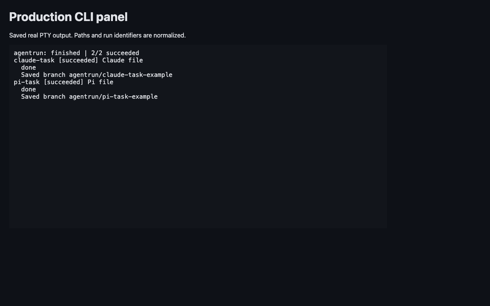

# Step 10: durable run reports

The CLI saves Markdown, typed JSON, patches and full task events.
Report writes use the core service, independent of terminal redraws.
Resume retains successful results and appends events.
Unknown cost appears as `n/a`.

## Tested candidate

- Branch: `feat/reports`.
- Starting commit: `a062343f7b7b8eabc7afe3a6f9bc07159392a0f9`.
- Verified implementation commit: `17e037bc2291ec37f15a144900e818f73e317783`.
- `candidate.json` records the source hashes checked before that commit.
- Node 24.21.0, Git 2.55.0, Effect 4.0.0 and macOS kernel locks.
- Claude SDK 0.3.288 and Pi SDK 1.0.0, through the shipped CLI workers.
- Lint, typecheck, 192 tests, both builds and whitespace checks passed.
- The original 165 tests and seven terminal scenarios remain in the suite.

The paid run tested the original report implementation. It used two provider task calls.
The final candidate adds fixes for immutable deliveries, terminal failure recovery, exact patch bytes, and patch validation.
Its proof uses test providers, real Git, filesystem crashes, and the built CLI.
The final build reprints and resumes the retained production run without a provider worker launch.
Original patch bytes, events, results, timing, cost, files, and branch commits remain unchanged.
The private fixture receives verified delivery commits and patch digests; its state and JSON report change for that upgrade.
The manifest separates the original paid candidate from the final candidate.

## Production result

One bounded run completed one task with each provider.
Claude used three turns at most and a USD 0.25 budget.
Pi used `openai/gpt-6-astra`, verified through the installed SDK.
The external deadline was 90 seconds, with bounded interrupt cleanup.

| Task | Duration | Reported cost | Saved patch |
|---|---:|---:|---|
| claude-task | 4.178 seconds | USD 0.0880716 | 1 file, +1 -0 |
| pi-task | 9.500 seconds | USD 0.022406 | 1 file, +1 -0 |

Both files contained the requested text.
Both retained branches contain commits with those files.
Each event file contains seven normalized provider events.
The patches match Git output byte for byte and pass `git apply --check`.
Both task worktrees were removed and the repository lock was released.

The first preflight stopped before prompts because `doctor` expected a removed `cli.js` file.
The check now resolves the installed native executable and accepts missing-auth JSON with exit 1.
The corrected production preflight passed. Neither credential files nor settings were edited by this task.

## Saved evidence

[report.md](report.md), [report.json](report.json) and the task patches are sanitized copies.
Paths, run identifiers, delivery commits, and branch suffixes are normalized. Prompt text is omitted.
Example digests describe the sanitized patch files.
Raw events and process captures remain in private storage.



The panel replay uses xterm.js 6 with Unicode graphemes.
Running, success, failure, interruption, resize and resume states were inspected.
The production capture shows both successful tasks.

## Repeat checks

Set `NODE24` to a Node 24 executable and `PNPM` to the pnpm executable.
The original absolute executable paths and private output directory are omitted.
Run these commands from the repository root, in sequence:

```sh
export PATH="$(dirname "$NODE24"):$PATH"
"$NODE24" "$PNPM" lint
"$NODE24" "$PNPM" typecheck
AGENTRUN_TEST_EVIDENCE="$(mktemp -d)" "$NODE24" "$PNPM" test --maxWorkers=1
"$NODE24" "$PNPM" build
git diff --check
```

For another explicitly authorized paid run, use a new private directory:

```sh
PRIVATE_DIR="$(mktemp -d)/run"
AGENTRUN_E2E_REAL=1 python3 packages/cli/scripts/run-report-e2e.py "$NODE24" "$PRIVATE_DIR" "$INSTALLED_CLI"
```

The driver checks doctor and model availability before prompts.
It creates a minimal Git repository and records commands, processes, reports, events and PTY bytes.
It checks file content, branch commits, cost, duration, worktree cleanup and report JSON.
It does not retry failed provider calls.

## Durability and limits

The runner saves terminal completion or failure before appending the terminal event.
Each new attempt records its event file offset before provider startup.
Resume recovers failures before task selection; another call requires `--retry-failed`.
The runner creates a Git commit object, records its identity, then publishes the branch.
Publication checks the old branch identity and preserves later user commits.
Patch output stays as bytes. UTF-8 decoding is used only for display and line counts.
The runner saves the patch and its SHA-256 digest before marking success.
Report and resume require a readable regular file and verify recorded digests.
Corrupt artifacts cause a typed error; resume does not overwrite them.
A report error includes a typed error, file path and reason.
A stale report causes refusal until resume reconciles it.

Existing legacy patches remain authoritative; resume adds a digest without changing their bytes.
Without an old digest, earlier corruption cannot be detected.
A missing legacy patch without a verified commit and digest causes a typed refusal.
A legacy retry with an ambiguous Failed event and no attempt boundary also causes a typed refusal.
These cases need external evidence to establish the original delivery or attempt.
Text and timing that were never recorded remain unavailable.
Successful duration ends at the provider completion event.
Failed and interrupted duration ends at the saved transition.
Binary patches are retained; line counts describe text hunks.

Atomic replacement covers process crashes, not a power-loss guarantee through `fsync`.
A corrupt event file causes typed refusal rather than silent truncation.
Provider retries and task timeouts remain outside this phase.
This candidate has local macOS proof; its Linux CI remains with the parent.
